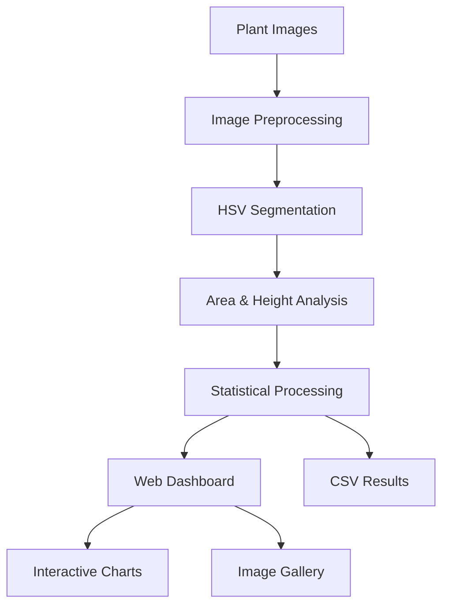

 #Note : The dataset folder link is given here since it is too large to be uploaded to github directly . It is divided into day 1 , day 2, day 3. https://drive.google.com/drive/u/0/folders/1OkgRHBYRSm_R4jTC8WEj-  eaWLdkgB36R?lfhs=2

# 🌱 Plant Growth Monitoring System

A comprehensive automated plant growth analysis system using Computer Vision and web-based monitoring dashboard.

## 💡 Project Overview

This system monitors plant growth automatically by capturing and analyzing images over time. It provides objective assessment of growth rate, health, and development through advanced computer vision techniques and an interactive web dashboard.

### Key Features
- **Green Area Analysis**: Measures photosynthetic leaf surface coverage
- **Plant Height Estimation**: Tracks vertical growth progression in pixels  
- **Growth Trend Visualization**: Interactive charts and static plots
- **Web Dashboard**: Real-time analytics with plant image gallery
- **Health Categorization**: Automatic classification of plant health status

## 🛠️ Tech Stack

| Component | Technology Used |
|-----------|----------------|
| Programming Language | Python 3.9+ |
| Image Processing | OpenCV, Scikit-Image |
| Data Handling | NumPy, Pandas |
| Visualization | Matplotlib, Chart.js |
| Web Interface | Flask |
| Image Serving | Flask static file serving |

## 📂 Directory Structure

```
PlantGrowthMonitoring/
│
├── dataset/             # Plant images organized by day
│   ├── day1/           # Day 1 images (Healthy, EarlyBloom, MatureBud, etc.)
│   ├── day2/           # Day 2 images
│   └── day3/           # Day 3 images
│
├── src/                # Core Python modules
│   ├── preprocessing.py # Image loading and resizing
│   ├── segmentation.py  # Green region detection (HSV thresholding)
│   ├── analysis.py      # Area and height calculations
│   ├── visualization.py # Growth trend plotting
│   └── main.py         # Main execution script
│
├── models/             # Output data
│   └── results.csv     # Growth metrics (Area, Height, Day)
│
├── app/                # Web dashboard
│   └── app.py          # Flask web interface with image gallery
│
├── requirements.txt    # Project dependencies
├── README.md          # Documentation
└── run_project.py     # Quick launcher script
```

## 🚀 Installation & Setup

### 1. Clone the Repository
```bash
git clone https://github.com/yourusername/PlantGrowthMonitoring.git
cd PlantGrowthMonitoring
```

### 2. Install Dependencies
```bash
pip install -r requirements.txt
```

### 3. Prepare Your Dataset
Place your time-series plant images into the `dataset/` folder, organized by day:
```
dataset/
├── day1/
│   ├── Healthy_001.jpg
│   ├── EarlyBloom_002.jpg
│   └── ...
├── day2/
│   └── ...
```

## ▶️ How to Run

### Method 1: Complete Analysis Pipeline
Run the full analysis to process images and generate results:
```bash
python src/main.py
```
This will:
- Process all images in the dataset
- Generate `models/results.csv` with growth metrics
- Create visualization plots

### Method 2: Web Dashboard (Recommended)
Launch the interactive web dashboard:
```bash
# From project root directory
python app/app.py
```
Then open your browser and navigate to: **http://127.0.0.1:5000**

### Method 3: Quick Launcher
Use the convenience script:
```bash
python run_project.py
```

## 🌐 Web Dashboard Features

The Flask web application provides a comprehensive plant monitoring interface:

### 📊 Analytics Dashboard
- **Real-time Growth Metrics**: Area growth, height growth, health scores
- **Statistical Insights**: Growth rates, variability analysis, consistency metrics
- **Performance Indicators**: Data quality, growth acceleration, trend analysis
- **Interactive Charts**: Hover-enabled growth trend visualization

### 🖼️ Plant Image Gallery
- **Day-by-Day Browsing**: Select any day to view plant images
- **Health Categorization**: Images organized by status:
  - 🟢 **Healthy**: Vibrant, well-developed plants
  - 🟠 **Early Bloom**: Plants beginning to flower
  - 🟣 **Mature Bud**: Fully developed flowering stage
  - 🔵 **Young Bud**: Early bud development
  - 🔴 **Wilted**: Stressed or declining plants
- **Full-Size Viewing**: Click images for detailed modal view
- **Color-Coded Interface**: Easy visual identification of plant categories

### 📈 Static Plot Visualization
- **Area Growth Analysis**: Error bars showing measurement variability
- **Height Growth Tracking**: Trend lines with statistical confidence
- **Progress Tracker**: Normalized development comparison

## 📈 Output & Results

### Data Output
| Parameter | Description |
|-----------|-------------|
| **Area** | Green pixel count (leaf coverage) |
| **Height** | Vertical plant extent in pixels |
| **Day** | Time series identifier |
| **Health Score** | Composite plant health metric |

### Example Results
| Day | Area | Height | Health Score |
|-----|------|--------|--------------|
| day1 | 24500 | 120 | 85 |
| day2 | 29780 | 145 | 92 |
| day3 | 35020 | 162 | 88 |

## 📋 Methodology

The system uses a computer vision pipeline:

1. **Preprocessing**: Load and resize images for uniformity
2. **Segmentation**: HSV color thresholding to isolate plant regions
3. **Analysis**: Calculate area (pixel count) and height (vertical extent)
4. **Visualization**: Generate growth trend charts and statistics
5. **Web Serving**: Interactive dashboard with image gallery



## 🔧 Configuration

### Image Requirements
- **Format**: JPG, JPEG, PNG
- **Organization**: Images must be in day-based folders
- **Naming**: Descriptive names with health category prefix (optional)

### Performance Notes
- Web dashboard loads 10 sample images per day for optimal performance
- Images are served on-demand to reduce memory usage
- Caching system prevents redundant processing

## 🤝 Contributing

1. Fork the repository
2. Create a feature branch (`git checkout -b feature/amazing-feature`)
3. Commit your changes (`git commit -m 'Add amazing feature'`)
4. Push to the branch (`git push origin feature/amazing-feature`)
5. Open a Pull Request

## 📄 License


This project is licensed under the MIT License - see the LICENSE file for details.
